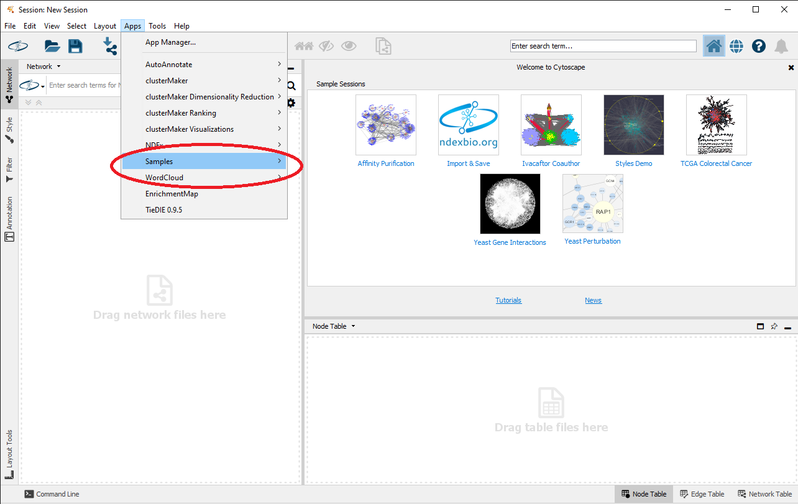

# causalpath_cytoscape_app

# Instruction to Run the causalpath_cytoscape_app
# Pre- Requisites
```
Java
Maven
Cytoscape
```
# Step 1 
Clone this repository into local desktop.
```
Navigate to the directory "<your path to this directory>\causalpath_cytoscape_app\CausalPath Cytoscape App\" using cmd 
or open Git Bash in the mentioned directory.
```
# Run the following commands
```
command 1.mvn compile
command 2.mvn clean install
```
A Build Success will be shown in the cmd and a jar file named <b>causalpath_cytoscape_app-1.0</b> will be created in <b>/target</b> folder of the current directory.
# Step 2
```
1.Copy the App from the <b>/target</b> folder into "C:\Users\<your PC_NAME>\CytoscapeConfiguration\3\apps\installed".
2. Open the Cytoscape app and click on <b>Apps</b> from the menu bar and It will look something like following. 
```


